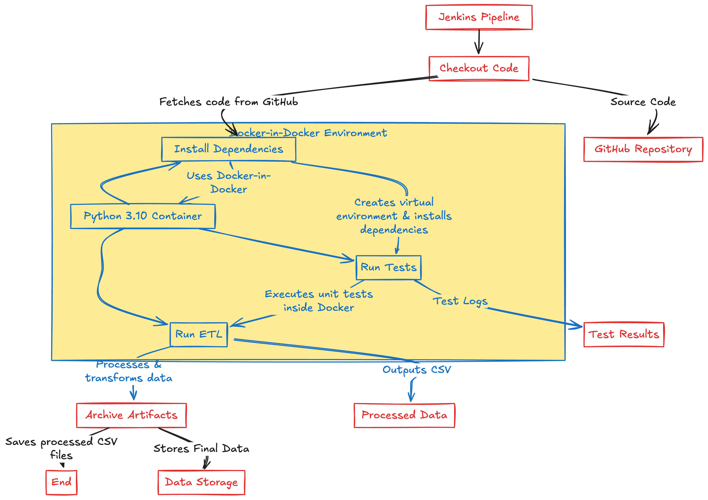

# Jenkins Pipeline with Docker-in-Docker

This repository contains a Jenkins pipeline that demonstrates building and running Python-based applications inside Docker containers within a Jenkins environment—leveraging *Docker-in-Docker (DinD)*. The approach is inspired by the [Docker in Docker: The Good and The Bad](https://medium.com/@parameshwarbhat411/docker-in-docker-the-good-and-the-bad-48cfe4e0da6e) article.

> **Note:** Docker-in-Docker allows you to run Docker commands within a container, which is especially useful for CI/CD pipelines that need to build, test, and deploy applications. However, it should be used with caution due to potential security implications and performance considerations.

---

## Table of Contents

1. [Pipeline Overview](#pipeline-overview)
2. [Prerequisites](#prerequisites)
3. [Jenkins Configuration](#jenkins-configuration)
4. [Pipeline Stages Explained](#pipeline-stages-explained)
5. [How to Run](#how-to-run)
6. [Security Considerations](#security-considerations)
7. [References](#references)

---
## Architecture Diagram



## Pipeline Overview

This Jenkins pipeline illustrates a typical workflow for a Python-based project:

1. **Checkout**: Clones the repository from GitHub.
2. **Install Dependencies**: Sets up a Python virtual environment and installs required packages.
3. **Run Tests**: Executes unit tests to ensure code quality.
4. **Run ETL**: Executes an ETL (Extract, Transform, Load) process.
5. **Post-Build Actions**: Archives generated CSV artifacts.

All Docker commands are executed inside Docker containers using the `python:3.10` image, ensuring a consistent and isolated build environment.

## Goal / Outcome

The Jenkins pipeline automates the **end-to-end execution of a Python-based ETL workflow** within a **Docker-in-Docker (DinD) environment**. The primary objectives of this pipeline are:

- **Ensure a consistent and isolated execution environment** by running all steps inside a Docker container.
- **Automate dependency management** by setting up a virtual environment and installing required Python packages.
- **Run automated tests** to validate the correctness and stability of the ETL scripts.
- **Execute the ETL pipeline** to extract, transform, and load data efficiently.
- **Archive processed data artifacts (CSV files)** for further analysis or downstream processing.

By leveraging **Docker-in-Docker**, this pipeline provides a **scalable, reproducible, and CI/CD-friendly workflow**, ensuring seamless ETL execution within Jenkins while maintaining containerized environments.

---

## Prerequisites

- **Jenkins** up and running (version 2.190+ recommended).
- **Docker** installed on the Jenkins host (to run DinD containers).
- A **GitHub** repository containing your project code.
- Jenkins **credentials** configured for accessing your GitHub repository.
- (Optional) A **Docker registry** account if you plan to push images externally.
- Ensure the Docker network `my-network` is created if your pipeline relies on it.

---

## Jenkins Configuration

1. **Docker Plugin**:
   - While not strictly required for DinD, many Jenkins setups utilize the [Docker plugin](https://plugins.jenkins.io/docker/) to manage Docker-based build agents.

2. **Docker Agent** (Privileged Mode):
   - If using Jenkins agents (slaves) in containers, ensure your Docker agent or the Docker host is configured to allow privileged containers or to mount the Docker socket.
   - For DinD, you might run the Jenkins agent container with `--privileged` and mount the Docker socket:
     ```sh
     docker run --privileged -v /var/run/docker.sock:/var/run/docker.sock jenkins/jenkins:lts
     ```

3. **Environment Variables**:
   - `RUNNING_IN_DOCKER`: Set to `true` to indicate that the pipeline is running inside Docker.
   - Configure other environment variables as needed directly in the `Jenkinsfile` or via Jenkins’ global environment settings.

4. **Credentials**:
   - Ensure that the `credentialsId` (`parameshwarbhat411` in your `Jenkinsfile`) is correctly set up in Jenkins to access your GitHub repository.

---

## Pipeline Stages Explained

### 1. Checkout

**Purpose**: Clones the repository from GitHub to the Jenkins workspace.

```groovy
stage('Checkout') {
    steps {
        git branch: 'main', credentialsId: "parameshwarbhat411", url: 'https://github.com/parameshwarbhat411/DE_Pipeline.git'
    }
}
```

### 2. Install Dependencies

**Purpose**: Sets up a Python virtual environment and installs necessary dependencies from `requirements.txt`.

```groovy
stage('Install Dependencies') {
    steps {
        script {
            docker.image('python:3.10').inside('--network my-network') {
                sh '''
                    python -m venv venv
                    . venv/bin/activate
                    pip install -r script/requirements.txt
                '''
            }
        }
    }
}
```

### 3. Run Tests

**Purpose**: Executes unit tests to verify the integrity of the codebase.

```groovy
stage('Run Tests') {
    steps {
        script {
            docker.image('python:3.10').inside('--network my-network') {
                sh '''
                    . venv/bin/activate
                    python -m unittest discover -s script
                '''
            }
        }
    }
}
```

### 4. Run ETL

**Purpose**: Runs the ETL (Extract, Transform, Load) process defined in `etl.py`.

```groovy
stage('Run ETL') {
    steps {
        script {
            docker.image('python:3.10').inside('--network my-network') {
                sh '''
                    . venv/bin/activate
                    python script/etl.py
                '''
            }
        }
    }
}
```

### Post-Build Actions

**Purpose**: Archives any generated CSV files for later review or usage.

```groovy
post {
    always {
        archiveArtifacts artifacts: '**/*.csv', allowEmptyArchive: true
    }
}
```

---

## How to Run

1. **Add the Jenkinsfile** to your repository.
2. **Create a New Pipeline Project** in Jenkins.
3. **Configure Docker Network**:
   ```sh
   docker network create my-network
   ```
4. **Run the Pipeline** from the Jenkins UI.
5. **Access Archived Artifacts** in the "Build Artifacts" section.

---

## Security Considerations

- **Privileged Containers**: Running Docker-in-Docker typically requires privileged mode.
- **Docker Socket Binding**: Grants full control over the Docker daemon—use with caution.
- **Environment Isolation**: Prefer ephemeral environments for builds to reduce security risks.
- **Credential Management**: Store credentials securely in Jenkins’ credentials store.

For more details, refer to the [Docker in Docker: The Good and The Bad](https://medium.com/@parameshwarbhat411/docker-in-docker-the-good-and-the-bad-48cfe4e0da6e) article.

---

## References

- [Docker in Docker: The Good and The Bad](https://medium.com/@parameshwarbhat411/docker-in-docker-the-good-and-the-bad-48cfe4e0da6e) by Parameshwar Bhat
- [Official Jenkins Documentation](https://www.jenkins.io/doc/)
- [Docker Documentation](https://docs.docker.com/)
- [Jenkins Docker Plugin](https://plugins.jenkins.io/docker/)
- [Python Docker Image on Docker Hub](https://hub.docker.com/_/python)

---